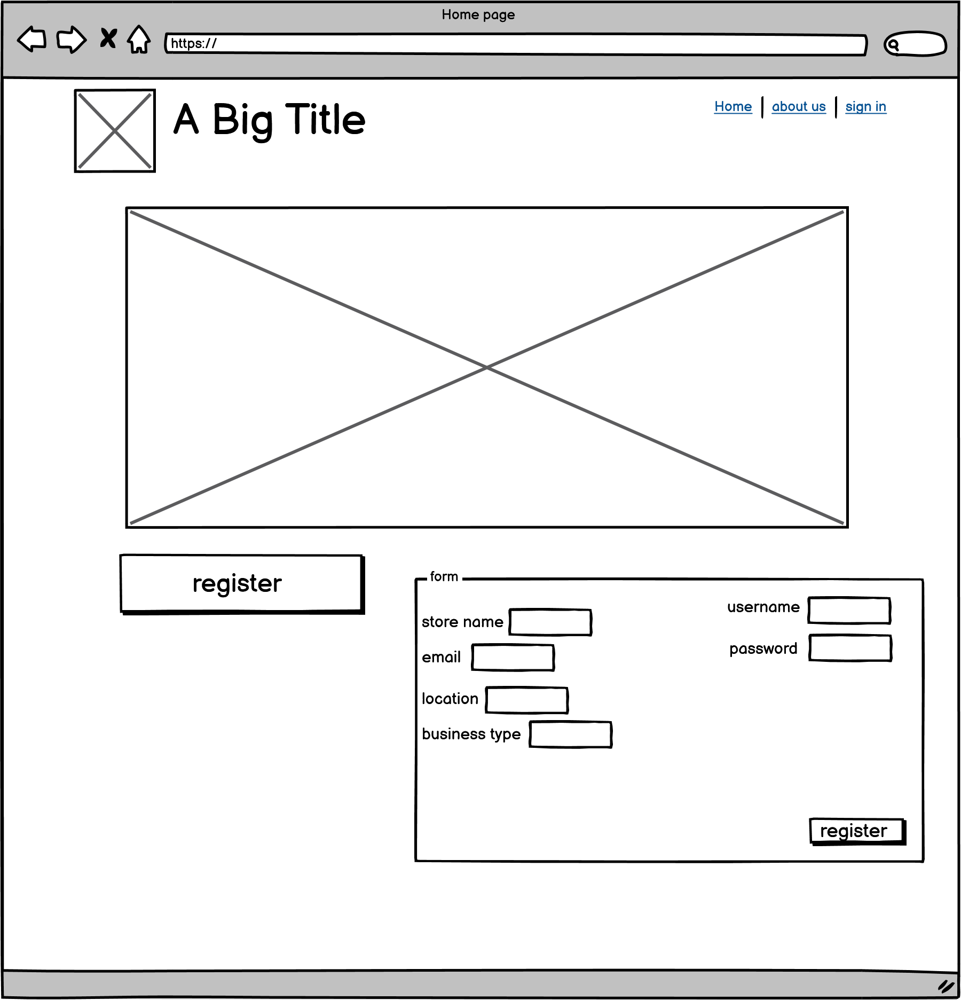
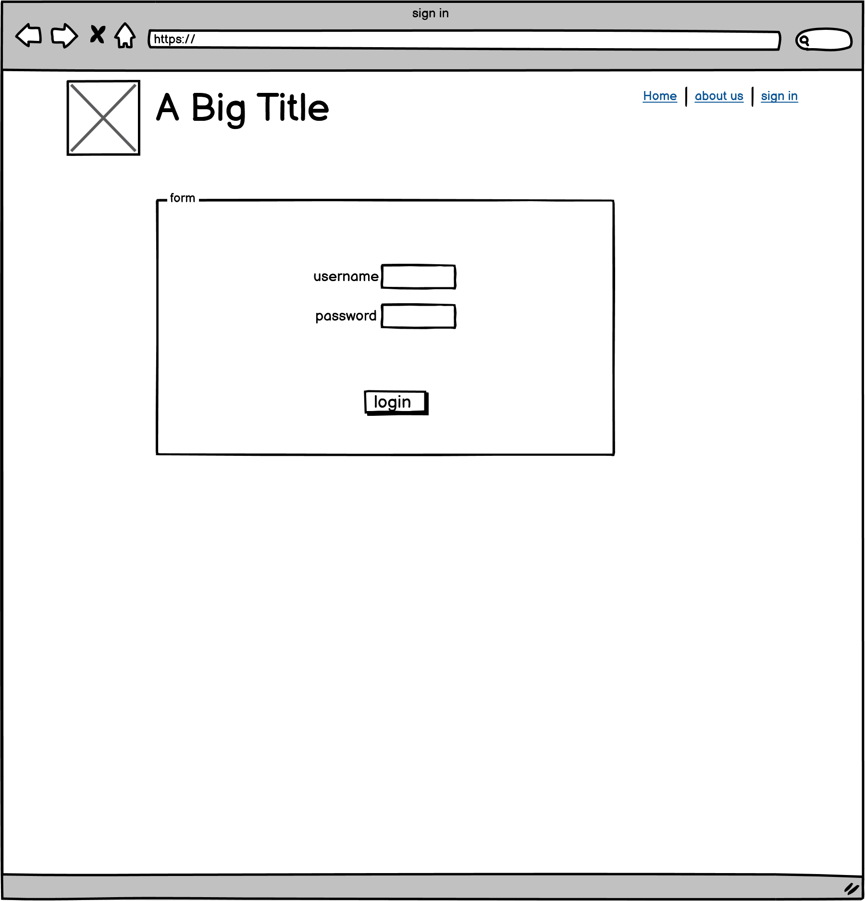
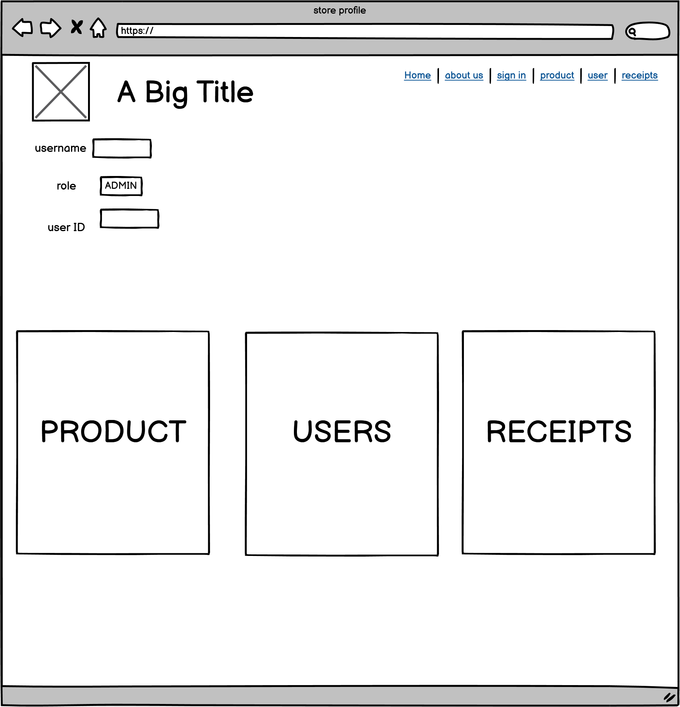
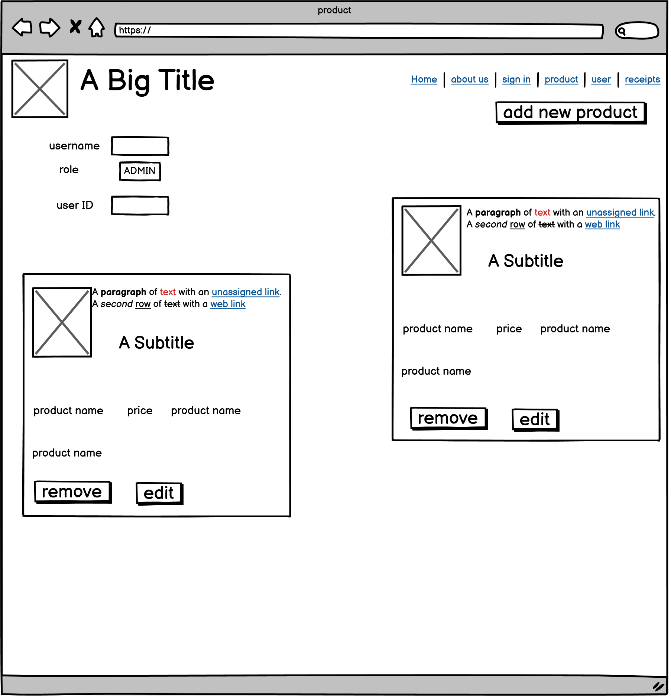
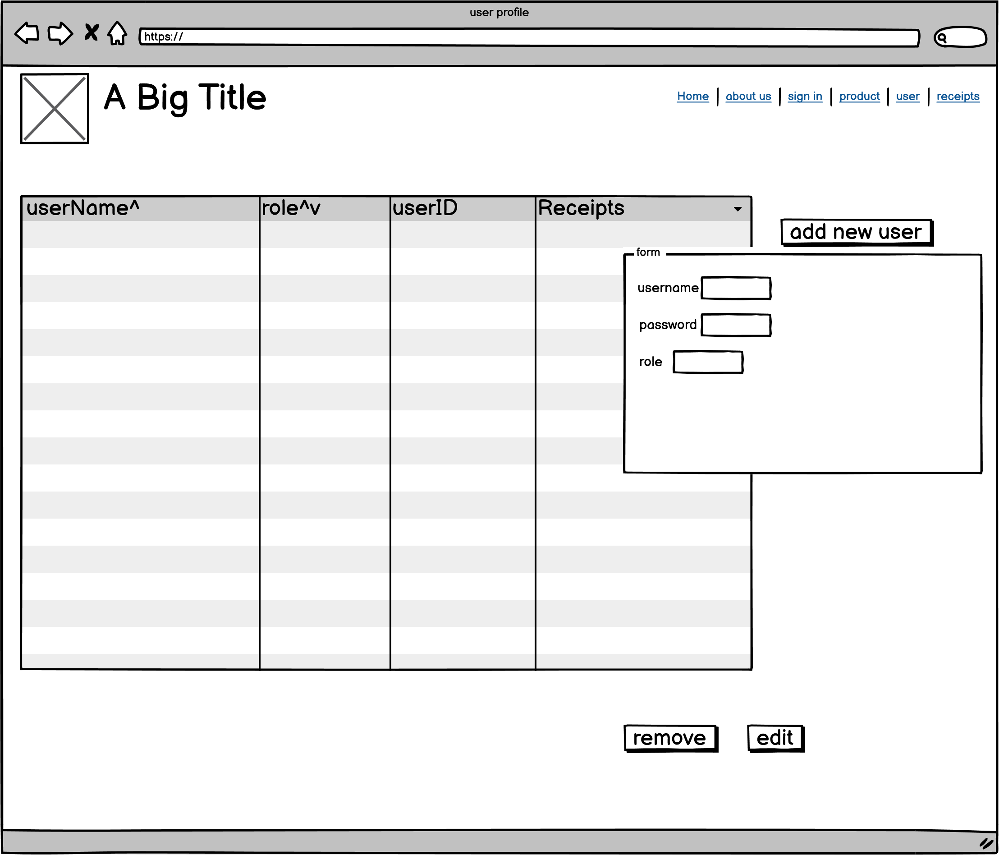
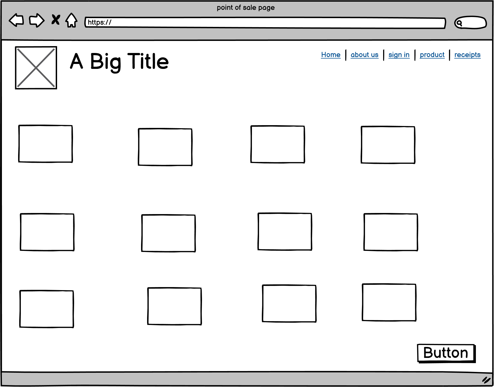
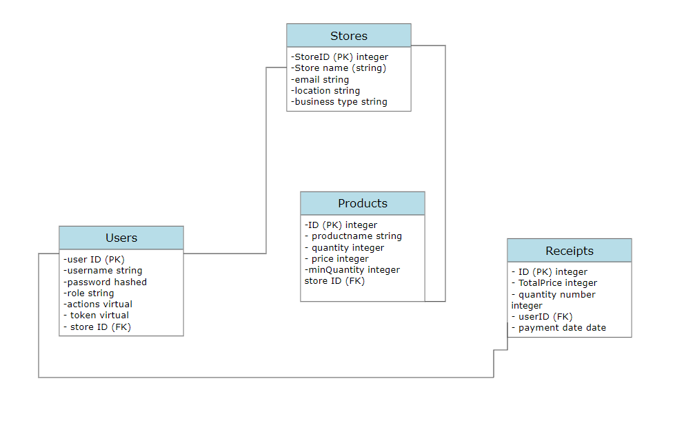

# Point-of-Sale

**by debuggers team** :

- Mohammad Salameh
- Jalal Hasan
- Leen Ahmad
- Neveen Aburomman
- Manal Albahar

## routes

- /register

  - method: post
    - bodyExample :

  ```json
  {
    "storeName": "example-store",
    "email": "store@example.com",
    "location": "amman",
    "businessType": "retail",
    "username": "admin",
    "password": "@dmiN123"
  }
  ```

- /user

  - method : post
    - bodyExample:

  ```json
  {
    "username": "cashier",
    "password": "c@sHier123",
    "role": "cashier"
  }
  ```

- /user/:id

  - method: get
    - response:

  ```json
  {
    "id": "2",
    "username": "cashier",
    "password": "hash"
  }
  ```

## Wireframe

- home page

  - 
  - API paths used: /register, method: post

- Sign in page

  - 
  - API paths used: /signin, method: post

- store page

  - 
  - API paths used: /store/id, method: post

- product page

  - 
  - API paths used:
    - /products, method: get
    - /product, method: post
    - /product/:id, methods: put, delete, get

- Users page
  - 
  - API paths used:
    - /user, method: post
    - /storeEmps, method: get
    - /users, method: get
    - /user/:id, methods: put, delete, get

- Receipts page
  - 
  - API paths used:
    - /getReceipt, method: get
    - /getReceipt/:id , method: get
    - /receipt/:id, method: delete, put, get

- POS for cashier (products page)
  - 
  - API paths used:
    - /products, method: get
    - /product/:id, method: get, put
    - /receipt, method: post

## Database

- model:



- users:

  | ID (PK) serial | username string | password(hashed) | role string | actions Virtual | Token Virtual | storeID (FK) integer |
  | -------------- | --------------- | ---------------- | ----------- | --------------- | ------------- | -------------------- |

- stores:

  | ID (PK) serial | storename sting | email string | location string | business type string |
  | -------------- | --------------- | ------------ | --------------- | -------------------- |

- products:

  | ID (PK) serial | productName sting | quantity integer | price integer | minQuantity integer | storeID (FK) integer |
  | -------------- | ----------------- | ---------------- | ------------- | ------------------- | -------------------- |

- receipts:

  | ID (PK) serial | total integer | product ARRAY | userID (FK) string | paymentMethod string | discount | totalAfterDicount |

  | -------------- | ------------- | ------------- | ------------------ | -------------------- | -------- | ----------------- |

## Stories

- Register a store

  - as a user I would like to register my store (this is process is implemented by the user sending a form containing the store name, the store owner email address, the store location and store type of business )
  - As software admin, we start by creating a store and adding the store owner as an admin to the recently created store, hashing passwords, adding an entry to user tables related to the specific store using the store ID.
  - check if the entry was added

- adding employees

  - as a user I would like to add employees with their respective roles
  - check permession, signup endpoit, adding an entry to user tables.
  - check if the entry was added successfully, check if the endpoint is working correctly (CRUD)

- inventory management

  - I would like to check and manage my inventory
  - adding new products to the stores table, checking quantitiy, price editing
  - check if the entry was added successfully, check if the endpoint is working correctly (CRUD)

- getting data

  - as a user I would like to see my products with their data (price, description)
  - check permession, check token, /product endpoint
  - check if the output is as expected.

- Selling

  - as a user I would like to perform a selling process using the POS
  - adding products to cart with specific quantitiy, calculate total price, reduce the quantity from the database
  - check if the pos is working correctly

- daily reports
  - as a user I would like to get a report on my daily sales
  - get data from receipts table when the date is equal to today's.
  - check if the daily report is working correctly.
