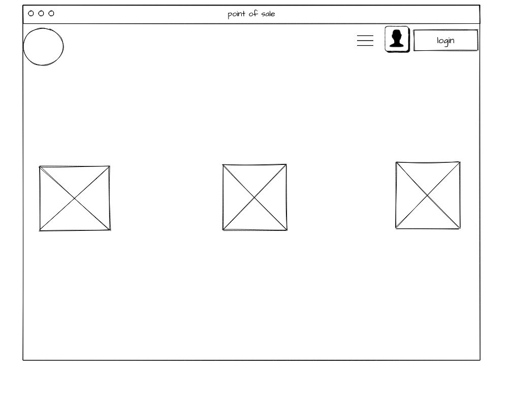
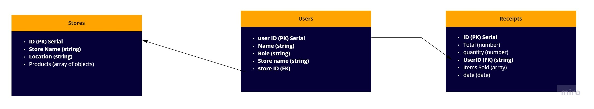

# Point-of-Sale

## Wireframe

## Database

**Data Model**

- users:

  | ID (PK) serial | NAME string | password(hashed) | role string | storename string | storeID (FK) string |
  | -------------- | ----------- | ---------------- | ----------- | ---------------- | ------------------- |

- stores:

  | ID (PK) serial | storename sting | location string | productId (FK) |
  | -------------- | --------------- | --------------- | -------------- |

- products:

  | ID (PK) serial | productName sting | quantity integer | price integer | minQuantity integer|
  | -------------- | ---------- | --------------- | ------------- | ------------- |

- receipts:

  | ID (PK) serial | total integer | quantity integer | userID (FK) string | items sold (array) | date (date) |
  | -------------- | ------------ | --------------- | ------------------ | ------------------ | ----------- |

## Stories

1. Register a store

- as a user I would like to register my store
- singup endpoint, hashing passwords, adding an entry to user tables
- check if the entry was added

2. adding employees

- as a user I would like to add employees with their respective roles
- check permession, signup endpoit, adding an entry to user tables.
- check if the entry was added successfully, check if the endpoint is working correctly (CRUD)

3. inventory management

- I would like to check and manage my inventory
- adding new products to the stores table, checking quantitiy, price editing
- check if the entry was added successfully, check if the endpoint is working correctly (CRUD)

4. getting data

- as a user I would like to see my products with their data (price, description)
- check permession, check token, /product endpoint
- check if the output is as expected.

5. Selling

- as a user I would like to perform a selling process using the POS
- adding products to cart with specific quantitiy, calculate total price, reduce the quantity from the database
- check if the pos is working correctly

6. daily reports

- as a user I would like to get a report on my daily sales
- get data from receipts table when the date is equal to today's.
- check if the daily report is working correctly.
